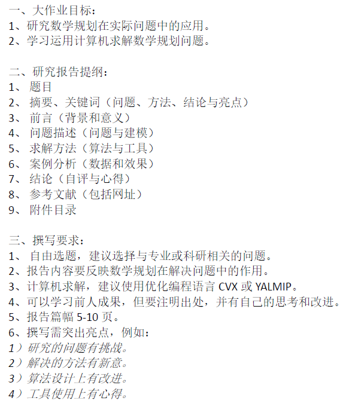

# 图像去噪

## Cite

[图像去噪技术汇总](https://github.com/wenbihan/reproducible-image-denoising-state-of-the-art?tab=readme-ov-file)

[红外摄像头和热成像的图像数据集](https://github.com/dlut-dimt/TarDAL)

[无人机巡检得到的电力绝缘子图像数据集](https://github.com/zhangzhengde0225/FINet)

[开源的绝缘子数据集](https://github.com/heitorcfelix/public-insulator-datasets)

## 图像噪声的来源

1. **摄像头传感器的噪声**：摄像机、红外扫描仪等图像采集设备本身会引入噪音，这是由于设备的电子元件和信号处理过程中的微小不确定性。
2. **传感器特性：** 不同类型的传感器（例如CMOS、CCD）具有不同的特性，它们在信号处理过程中可能会引入特定类型的噪音。
3. **信号采样误差：** 在信号采样过程中，由于采样率不足或量化误差等原因，会引入噪音。
4. **环境条件**：光线不足、强光、阴影等环境因素可能会导致图像中的噪音增加。
5. **传输或存储中的干扰：** 在图像传输或存储过程中，信号可能会受到电磁干扰、压缩算法等因素的影响，从而产生噪音。
6. **设备老化或损坏：** 图像采集设备的老化、损坏或不稳定可能会导致图像中出现各种噪音。
7. **电磁干扰：** 来自电器设备、无线信号等电磁波的干扰可能会影响到图像质。
8. **恶意攻击者**：恶意攻击者使用无线技术实现攻击，导致色块缺失或图像混乱。
