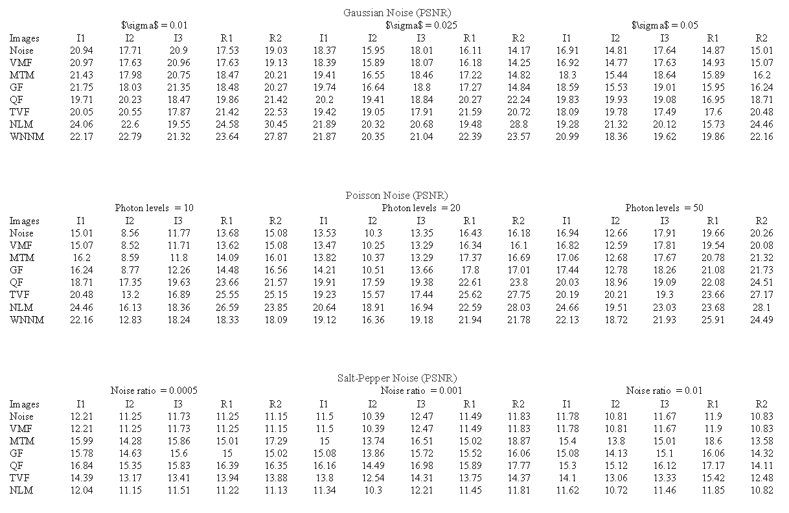

# Image Denoising

## Installation

### Create a Conda Environment

Create and access a Python 3.8 environment using [`conda`](https://docs.conda.io/projects/conda/en/latest/user-guide/install/index.html)

```bash
conda create -n denoise python=3.8
conda activate denoise
```

Install the this repository and initial python environment.

```bash
git clone https://github.com/Jackey-Marine/Convex-optimization-for-image-denoising
pip install --upgrade pip
pip install -r requirements.txt
```

### Install Mosek

Obtain [MOSEK&#39;s license](https://www.mosek.com/products/academic-licenses/) (free for academia).
Once you have received (via e-mail) and downloaded the license to your own `~/Downloads` folder, install it by executing

```bash
mkdir ~/mosek 
mv ~/Downloads/mosek.lic ~/mosek/
```

## Results


